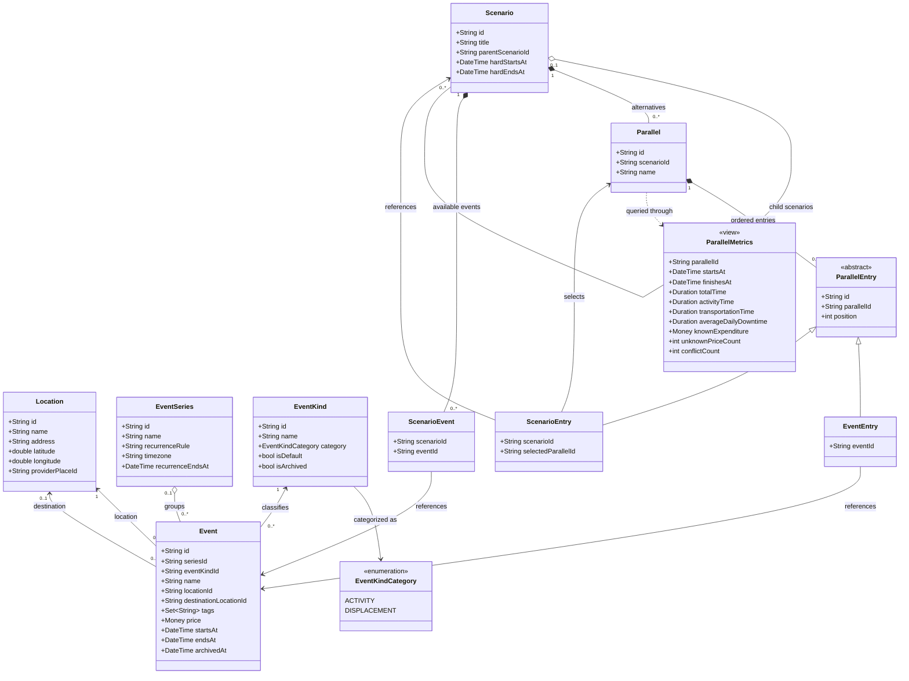

## Technical design

The system is a shared graph of Events and Scenarios. A Parallel is one traversal through that graph.

We use the following types:

* **Event:** a concrete scheduled activity or displacement with a required start and end.
* **EventSeries:** an optional group of repeating Events, such as “Bachata Weeklies.”
* **EventKind:** a user-defined classification belonging to either `ACTIVITY` or `DISPLACEMENT`.
* **Scenario:** a named group of Parallels, such as “Trip to Italy.” Scenarios may contain nested Scenarios, such as “3 days in Rome,” and may be referenced from larger Parallels.

A Parallel is an ordered traversal referencing shared objects:

```text
Parallel A
Event 1 → Event 2 → Scenario 1 → Event 4

Parallel B
Event 1 → Event 3 → Scenario 1 → Event 4
```

Events with an EventKind in the `DISPLACEMENT` category represent walking, driving, public transport, trains, flights, transfers, layovers, and similar movements.

The paths may branch and rejoin. Shared Events and Scenarios are not copied into each path. Each Parallel represents a potential itinerary.

A Scenario may define optional hard start and end times. Missing boundaries are derived from the earliest start and latest end of its selected internal Parallel. When a Scenario is referenced from a larger Parallel, the reference identifies which internal Parallel is being used.

Therefore:

* Editing a shared Event updates every Parallel containing it.
* Removing an Event from one Parallel does not delete the Event.
* A Scenario can contain an Event without that Event belonging to a Parallel.
* Scenarios can group alternatives and act as composite sections of larger itineraries.
* Time conflicts are surfaced as warnings so users can handle them themselves.
* A Parallel owns references and ordering, not Event or Scenario data.
* An Event may belong to zero or one EventSeries.
* Modifying an EventSeries can update its related Events together.

Metrics are calculated from the selected traversal using SQLite views. Nested Scenarios contribute through their selected internal Parallel and effective temporal boundaries. Metrics are not stored on the underlying Events.

### Architecture




### Screens

* Scenario list
  * List of Scenarios with their nested Scenarios and Parallels.
  * Selecting a Scenario opens its Section view.
* Section view
  * Bunch of lines that run through different nodes lie on a linear time axis. (References: Git graphs, Node-RED, TreeSheets)
  * Time range on the axis does not use a equal width calendar scale. 
  * A nested scenario can be collapsed into one node spanning the time axis.
  * Shows all Events belonging to the Scenario and the Parallels passing through them.
  * Filter by day, week, or all.
  * Git-graph-style view with Events as nodes and time as rows.
  * Option to flip the time and Parallel axes.
  * Shared Events appear once, with multiple Parallel lines passing through them.
  * Events removed from every Parallel remain visible as disconnected blocks.
  * Archived Events are hidden by default or shown as disabled when requested.
  * Selecting a Parallel highlights its traversal and calculates its metrics in real time:
    * Known expenditure
    * Start and end
    * Time spent on transportation
    * Time spent on activities
    * Average downtime per day
    * Conflicts
  * The metric summary appears at the top as a small trapezoidal overlay.
  * Clicking or dragging the overlay opens the detailed Metrics view.
  * Nested Scenario nodes can be opened in place.
  * The closest Event on either side remains visible in a disabled state to preserve context.
  * Actions:
    * Add new Event
    * Add an existing Event to a Parallel
    * Remove an Event from a Parallel
    * Show archived Events
  * Removing an Event from a Parallel only removes the reference. The Event remains in the Scenario as a disconnected block.
* Create Event
  * Create a one-off Event.
  * Optionally repeat every day, week, month, or custom interval.
  * More precise recurrence options are available in a submenu.
  * Repeating Events belong to an EventSeries.
* Event view
  * Displayed as a drill-down screen on mobile and an extra-large modal on larger screens.
  * Actions:
    * Modify this Event
    * Modify the EventSeries
    * Archive
    * Delete
  * Deleting removes the Event everywhere.
  * If the Event is referenced by any Parallel, ask for confirmation that it is currently in use. Further details are not required.
  * Archiving preserves the Event and its references but hides it by default.
* Metrics view
  * Known expenditure
  * Number of Events with unknown prices
  * Time spent on transportation
  * Time spent on activities
  * Average downtime per day
  * Start and end
  * Total elapsed time
  * Conflicts
  * Pie graphs for time per day, total time, and expenditure
  * Route graph when multiple locations exist
* Import view
  * ics import (v2)
  * sync caldav and webdav (v3)